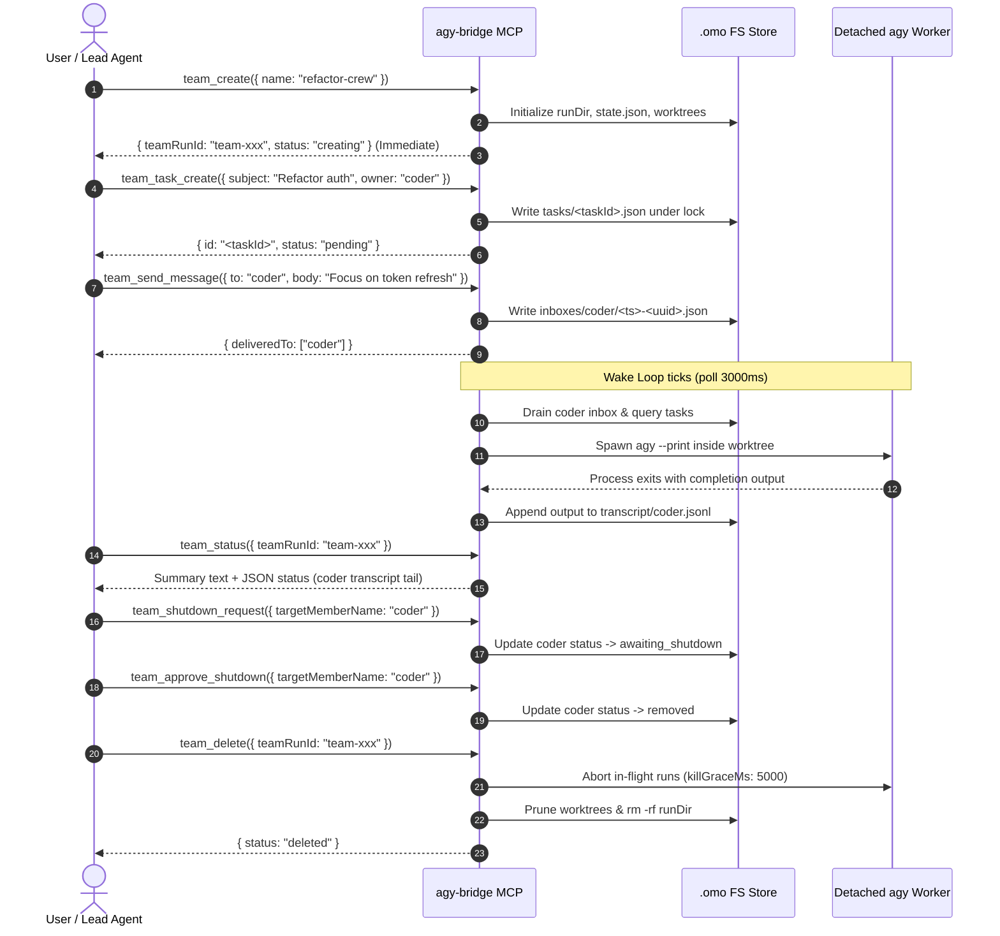

# Team Mode — agy-bridge

> **Multi-Agent Coordination Engine for `agy-bridge`**  
> Enables parallel execution of role-specialized agents in isolated git worktrees, synchronized via a file-based task list, mailbox queues, and an autonomous bridge wake loop.

---

## 1. Overview & Architecture

Team Mode in `agy-bridge` brings parallel multi-agent collaboration to Antigravity CLI workflows, modeling the operational interface of **Oh My OpenAgent (OMO)** team mode.

### 1.1 Batch Orchestrator vs. Live Interactive Agents

A fundamental architectural distinction exists between native OMO team mode and `agy-bridge` Team Mode:

| Dimension | Native OMO Team Mode | `agy-bridge` Team Mode |
| :--- | :--- | :--- |
| **Agent Execution Model** | Long-running interactive worker sessions (e.g. `opencode attach`, tmux panes) | Detached batch CLI processes (`agy --print`) executed per wake |
| **Tool Invocation by Members** | Members directly invoke `team_*` tools via their client interface | Members **cannot** invoke MCP tools (no MCP client config in `agy`); the bridge executes all protocol steps on their behalf |
| **Message Delivery** | Real-time live injection (`promptAsync`) with transient `.delivering-*.json` locks | File-based inbox queue (`.omo/runtime/<teamRunId>/inboxes/<member>/`) consumed at next idle wake turn |
| **Agent Responses** | Interactive tool calls (`team_send_message`, `team_task_update`, etc.) | Final stdout text captured and appended to `.jsonl` transcript logs |
| **Concurrency Control** | Process management + tmux pane multiplexing | In-memory FIFO `BoundedSemaphore` (`AGY_TEAM_MAX_PARALLEL`, default 4) |
| **Session Persistence** | Interactive daemon session IDs | CLI `--conversation <sessionId>` resumed across wake cycles |

### 1.2 The Bridge Wake Loop

Members do not continuously consume CPU or GPU tokens while waiting. Instead, the bridge runs an autonomous background polling loop:

```
                  +----------------------------------------------+
                  |         Bridge Wake Loop (every 3000ms)      |
                  +----------------------------------------------+
                                         |
                       Poll all members in TeamRunState
                                         |
        +--------------------------------+-------------------------------+
        |                                |                               |
 Member is running,          Member is idle AND has:            Member has
 awaiting_shutdown,          - unread inbox messages, OR        no pending work
 or removed                  - active owned tasks, OR           
        |                    - never been woken                 
        v                                |                               v
     [ Skip ]                            v                            [ Sleep ]
                           Acquire BoundedSemaphore slot
                                         |
                           Build Wake Prompt:
                           - Team context & Role directive
                           - Drain inbox messages (oldest-first)
                           - Owned task snapshot
                           - Autonomous report directive
                                         |
                           Spawn detached process:
                           `agy --print -p <prompt> [--conversation <id>]`
                           Working directory: isolated git worktree
                                         |
                           Process exits:
                           - Persist new or resumed sessionId
                           - Append stdout to transcript/<member>.jsonl
                           - Release semaphore slot & return member to idle
```

1. **Detection**: Every `AGY_TEAM_POLL_MS` (default `3000ms`), the loop checks all members in `state.json`. If a member is `idle` and has unread messages, active tasks (`pending`, `claimed`, `in_progress`), or has never been woken, a wake is scheduled.
2. **Context Assembly**: The bridge calls `buildWakePrompt()`, which atomically drains queued messages from `inboxes/<member>/`, queries active tasks owned by that member from `tasks/`, and formats a unified wake prompt.
3. **Execution**: The bridge acquires a permit from `BoundedSemaphore` (capped at `AGY_TEAM_MAX_PARALLEL`, default 4) and spawns `agy --print` inside the member's dedicated git worktree (`os.tmpdir()/agy-bridge-team-<teamRunId>-<member>`).
4. **Session Continuity**: On first wake, no conversation ID is passed; `agy` allocates a new session ID. The bridge records this `sessionId` in `state.json`. Subsequent wakes pass `--conversation <sessionId>` to maintain conversation context.
5. **Output Capture**: When the `agy` process completes, the bridge appends its stdout to `transcript/<member>.jsonl` and returns the member to `idle`.

---

## 2. Configuration & Environment Variables

Team Mode runtime settings are controlled via environment variables or file configuration (`~/.gemini/config/agy_bridge.jsonc`).

### 2.1 Environment Variables

| Variable | Type | Default | Description |
| :--- | :--- | :--- | :--- |
| `AGY_TEAM_MAX_PARALLEL` | `number` | `4` | Maximum number of concurrent detached `agy` member subprocesses across all teams. Regulated via `BoundedSemaphore`. |
| `AGY_TEAM_POLL_MS` | `number` | `3000` | Polling interval in milliseconds for the background wake loop (`startLoop`). |
| `AGY_TEAM_MEMBER_TIMEOUT_SEC` | `number` | `300` | Execution timeout in seconds for a single member wake turn before aborting the process. |
| `AGY_TEAM_KILL_GRACE_MS` | `number` | `5000` | Maximum grace period in milliseconds to wait for in-flight runs to settle during `team_delete` or process SIGINT/SIGTERM before tearing down worktrees and storage. |

### 2.2 Configuration Loading Priority

Configuration is resolved in `src/config.ts` with the following precedence:

1. **Environment Variables**: Explicit `process.env` values (e.g. `export AGY_TEAM_MAX_PARALLEL=2`).
2. **Configuration File**: JSONC file at `AGY_CONFIG_PATH`, `~/.gemini/config/agy_bridge.jsonc`, or `~/.gemini/config/agy_bridge.json`.
3. **Hardcoded Fallbacks**: Builtin default values (`4` parallel, `3000ms` poll, `300s` timeout, `5000ms` grace).

Example snippet for `~/.gemini/config/agy_bridge.jsonc`:

```jsonc
{
  "teamMaxParallel": 4,
  "teamPollMs": 3000,
  "teamMemberTimeoutSec": 300,
  "teamKillGraceMs": 5000
}
```

### 2.3 Model Configuration & Resolution Precedence

Model selection follows a strict precedence ladder:
1. **Explicit Model (`args.model`)**: One-shot override; bypasses cooldown and is not persisted across turns.
2. **Per-Tool Overrides (`toolModels[tool.name]`)**: Overrides configured per tool name (e.g. `web_lookup`, `delegate`, `follow_up`). Normalizes string or string array.
3. **Per-Role Overrides (`roleModels[roleKey]`)**: Overrides configured per agent role (e.g. `oracle`, `git-master`).
4. **Default Model (`defaultModel`)**: Global fallback model when configured.
5. **Builtin Chain (`OMO_ROLES[roleKey]?.chain` / `tool.chain`)**: Hardcoded defaults per role or tool.

If all candidate models in the resolved chain are exhausted by quota or server errors, `agy-bridge` raises `ALL_MODELS_EXHAUSTED` with a dynamic candidate list and quota reset wait instructions. Follow-up calls (`follow_up`) without an explicit model restart resolution from the primary model of the chain rather than locking onto the previous turn's failover model.

---

## 3. Quick Start & Usage Guide

Teams can be instantiated either by referencing a pre-saved named team spec on disk or by supplying an inline specification.

### 3.1 Method A: Named Team Specification (`.omo/teams/<name>/config.json`)

Saved team specifications live in the project repository under `.omo/teams/<name>/config.json`.

#### Example Spec: `.omo/teams/refactor-crew/config.json`

```json
{
  "version": 1,
  "name": "refactor-crew",
  "description": "Parallel code refactoring and test verification team",
  "leadAgentId": "architect",
  "backendType": "cli",
  "members": [
    {
      "name": "architect",
      "kind": "subagent_type",
      "subagent_type": "ultrabrain",
      "prompt": "Decompose tasks and coordinate architecture."
    },
    {
      "name": "coder",
      "kind": "category",
      "category": "deep",
      "prompt": "Implement code refactoring in isolated worktree."
    },
    {
      "name": "verifier",
      "kind": "subagent_type",
      "subagent_type": "quick",
      "prompt": "Run tests and verify test coverage."
    }
  ]
}
```

#### Launching the Named Team

Call `team_create` passing the name of the specification:

```json
{
  "name": "refactor-crew"
}
```

### 3.2 Method B: Inline Team Specification

You can pass `inline_spec` directly as a JSON object (or JSON string), or provide a flat `members` array.

#### Example: `team_create` with `inline_spec`

```json
{
  "inline_spec": {
    "name": "audit-squad",
    "leadAgentId": "lead",
    "members": [
      {
        "name": "lead",
        "kind": "subagent_type",
        "subagent_type": "ultrabrain"
      },
      {
        "name": "security-reviewer",
        "kind": "category",
        "category": "quick"
      }
    ]
  }
}
```

#### Example: `team_create` with Simple `members` Array

```json
{
  "name": "trio",
  "leadAgentId": "lead",
  "members": ["lead", "worker-1", "worker-2"]
}
```
*Note: String entries in `members` auto-normalize to `{ name, kind: "category", category: "engineering" }`.*

### 3.3 Member Specification Syntax & Role Resolution

Each team member is defined using a discriminated union on `kind`:

- **Category Member (`kind: "category"`)**:
  Requires `category` (e.g. `"deep"`, `"quick"`, `"engineering"`). Maps directly to execution roles.
- **Subagent Type Member (`kind: "subagent_type"`)**:
  Requires `subagent_type` (e.g. `"quick"`, `"deep"`, `"ultrabrain"`, `"oracle"`, `"qa"`).
- **Role Aliases**:
  To maintain full parity with OMO conventions, the following aliases automatically resolve without mutating global role registries:
  - `sisyphus` &rarr; `deep`
  - `sisyphus-junior` &rarr; `quick`
  - `atlas` &rarr; `ultrabrain`
- **Eligible Roles**:
  Unlike native OMO (which hard-rejects read-only agents), `agy-bridge` permits **all 18 built-in roles** as team members because the bridge orchestrator performs protocol execution on their behalf.

### 3.4 End-to-End Lifecycle Walkthrough



---

## 4. 12-Tool Parity Table

`agy-bridge` registers the complete 12-tool surface of OMO Team Mode with full schema compatibility.

| # | Tool Name | Primary Parameters & Aliases | Behavior & Implementation | Parity vs. Native OMO |
| :---: | :--- | :--- | :--- | :--- |
| **1** | `team_create` | `name` (`teamName`), `inline_spec` (`spec`), `members`, `leadAgentId`, `backendType`, `cwd` | Validates spec, spawns member worktrees in `os.tmpdir()`, writes initial `state.json` (`"creating"`), starts background wake loop, and returns immediately. | **Full / Batch Adaptation**<br>Returns `{ teamRunId, status: "creating" }` immediately. Restricts `backendType` strictly to `"cli"`. |
| **2** | `team_list` | `cwd` | Scans `.omo/runtime` for active runs and `.omo/teams` for named specs. Returns active runs sorted descending by timestamp alongside available named specs. | **Full Parity**<br>Returns dual list of active runs and discoverable specifications. |
| **3** | `team_status` | `teamRunId` (`team_id`), `cwd` | Aggregates wall-clock elapsed time, member states, task breakdown by status, unread message counts, and the tail (up to 500 chars) of member transcripts. | **Full Parity**<br>Dual presentation: LLM-friendly markdown text summary followed by parseable JSON payload. |
| **4** | `team_delete` | `teamRunId` (`team_id`), `cwd` | Halts wake loop, signals `AbortController` to in-flight runs, awaits drain (bounded by `killGraceMs`), force-removes git worktrees, runs `git worktree prune`, and deletes run directory. | **Full Parity**<br>Strictly idempotent: returns `{ status: "deleted" }` on subsequent calls without error. |
| **5** | `team_shutdown_request` | `teamRunId` (`team_id`), `targetMemberName` (`memberName`), `cwd` | Transitions member from `idle` or `running` to `awaiting_shutdown` under `state.lock`. Member finishes current run but the wake loop accepts no new work. | **Full Parity**<br>Enforces legal state transition matrix. |
| **6** | `team_approve_shutdown`<br>*(alias: `team_shutdown_approve`)* | `teamRunId` (`team_id`), `targetMemberName` (`memberName`), `cwd` | Transitions member from `awaiting_shutdown` to `removed`. Marks member concluded; member can no longer be woken. | **Full Parity**<br>Terminal member state transition. |
| **7** | `team_reject_shutdown`<br>*(alias: `team_shutdown_reject`)* | `teamRunId` (`team_id`), `targetMemberName` (`memberName`), `reason` *(mandatory)*, `cwd` | Rejects shutdown request with mandatory `reason` text, restoring member state from `awaiting_shutdown` back to `idle`. | **Full Parity**<br>Validates required rejection rationale before transitioning. |
| **8** | `team_send_message`<br>*(alias: `send_message`)* | `teamRunId` (`team_id`), `to` (`*` for broadcast), `body`, `from`, `cwd` | Writes per-message JSON file (`<ts>-<uuid>.json`) to `inboxes/<recipient>/` under lock. Enforces 32 KB payload cap and 256 KB recipient unread backpressure limit. | **Full / Batch Adaptation**<br>Queues messages on disk for wake-prompt consumption instead of live injection. |
| **9** | `team_task_create`<br>*(alias: `task_create`)* | `teamRunId` (`team_id`), `subject`, `description`, `owner`, `blockedBy` (`blocked_by`), `cwd` | Creates atomic task JSON file under `tasks.lock`. Initializes status as `pending` (or specified status) with dependency tracking. | **Full Parity**<br>Persists structured task entity. |
| **10** | `team_task_list`<br>*(alias: `task_list`)* | `teamRunId` (`team_id`), `status`, `owner`, `cwd` | Lists tasks filtered by status (`pending`, `claimed`, `in_progress`, `completed`, `deleted`) or owner. Omits `deleted` tasks by default. | **Full Parity**<br>Formatted listing with ID, status, and owner. |
| **11** | `team_task_get`<br>*(alias: `task_get`)* | `teamRunId` (`team_id`), `taskId` (`task_id`, `id`), `cwd` | Retrieves full JSON definition of a single task including blockers, timestamps, and owner. Returns `TASK_NOT_FOUND` if absent. | **Full Parity**<br>Direct read of task document. |
| **12** | `team_task_update`<br>*(alias: `task_update`)* | `teamRunId` (`team_id`), `taskId` (`task_id`, `id`), `status`, `owner`, `cwd` | Updates task status or ownership under `tasks.lock`. Enforces atomic claims (`claimed` requires owner), forward-only transitions, dependency checking (`blockedBy`), and cross-owner protections. | **Full Parity**<br>Strict state machine: prevents rollbacks and racing claims. |

---

## 5. Storage & Concurrency Architecture

### 5.1 Filesystem Layout

State is scoped locally to the project workspace under `.omo/`:

```
<projectRoot>/
├── .omo/
│   ├── teams/                                   # Committed or local named team specs
│   │   └── <name>/
│   │       └── config.json
│   └── runtime/                                 # Ephemeral team run state
│       └── <teamRunId>/
│           ├── state.json                       # Authoritative TeamRunState
│           ├── locks/                           # Lock files for concurrency
│           │   ├── state.lock
│           │   └── tasks.lock
│           ├── inboxes/                         # Member mailboxes
│           │   ├── <memberName>.lock
│           │   └── <memberName>/
│           │       └── <ts>-<uuid>.json         # Queued messages
│           ├── tasks/                           # Shared team tasklist
│           │   └── <taskId>.json
│           └── transcript/                      # Execution logs
│               └── <memberName>.jsonl
│
/tmp/ (or os.tmpdir())/
└── agy-bridge-team-<teamRunId>-<memberName>/    # Ephemeral detached-HEAD git worktrees
```

### 5.2 Atomic Operations & Store Primitives

All state mutations in `src/team/store.ts` use crash-resilient primitives:

- **Atomic JSON Write**: Files are written to a unique temp file (`${file}.tmp.${pid}.${uuid}`) and synced via `fsync` before an atomic POSIX `rename` replaces the target file (`src/team/store.ts:30-55`).
- **PID-Aware File Locks**: Concurrency is serialized via `open(..., 'wx')` exclusive lock files. Locks record the holding `pid` and acquisition timestamp (`src/team/store.ts:138`). Stale locks from dead processes (`ESRCH` via `process.kill(pid, 0)`) older than `staleMs` (default 30s) are automatically reaped (`src/team/store.ts:162-188`).

### 5.3 Mailbox Caps & Backpressure

Mailbox queues in `src/team/mailbox.ts` protect against unbounded memory and disk consumption:

- **Payload Cap (`MAX_PAYLOAD_BYTES = 32_768`)**: Single message bodies cannot exceed 32 KB (`src/team/mailbox.ts:9, 156-161`). Violations return `PAYLOAD_TOO_LARGE`.
- **Recipient Backpressure (`MAX_RECIPIENT_UNREAD_BYTES = 262_144`)**: Unread messages in a recipient's inbox cannot exceed 256 KB (`src/team/mailbox.ts:10, 186-210`). If a message would breach this ceiling, `RECIPIENT_BACKPRESSURE` is thrown atomically across all recipients before writing.

### 5.4 Task State Machine & Atomic Claims

Tasks in `src/team/tasklist.ts` follow a forward-only lifecycle:

```
[ pending ] ----(claimTask / updateTaskStatus)----> [ claimed ]
     |                                                    |
     |                                                    v
     |                                             [ in_progress ]
     |                                                    |
     |                                                    v
     +-------------------------------------------> [ completed ]
     |
     +----(delete)----> [ deleted ] (Terminal)
```

- **Atomic Claim Race**: Two agents attempting to claim the same pending task concurrently race under `tasks.lock`. Exactly one claimant succeeds; the loser receives `ALREADY_CLAIMED` (`src/team/tasklist.ts:159-162, 245-250`).
- **Dependency Gate (`blockedBy`)**: Tasks cannot be claimed until all blocker tasks reach `completed` or `deleted` status (`src/team/tasklist.ts:165-172`). Attempting to claim a blocked task raises `BLOCKED_BY`.
- **Forward-Only Progression**: State rollbacks (e.g. `completed` &rarr; `in_progress` or `in_progress` &rarr; `pending`) are rejected with `INVALID_TRANSITION` (`src/team/tasklist.ts:68-78, 300-302`).
- **Cross-Owner Protection**: Non-owners cannot update an assigned task unless performing an administrative deletion (`src/team/tasklist.ts:304-311`).

---

## 6. Code-Traceable Limitations

To provide complete technical transparency, every known limitation of `agy-bridge` Team Mode compared to native OMO team mode is documented below with exact source code citations.

### 6.1 Batch Engine & No Live Delivery Injection
- **Code Trace**: `src/team/mailbox.ts:212-248`, `src/team/runtime.ts:517-538`, `src/team/runtime.ts:1015-1018`, `src/team/runtime.ts:1101-1114`, `src/team/runtime.ts:1175-1212`.
- **Technical Detail**: Native OMO uses `promptAsync` to inject incoming messages live into active, running agent loops via transient `.delivering-*.json` files. In `agy-bridge`, messages are written as static JSON files to disk (`src/team/mailbox.ts:221-248`). The bridge poll loop periodically inspects the mailbox (`src/team/runtime.ts:1186-1192`), drains unread messages (`src/team/runtime.ts:517-538`), synthesizes a batch wake prompt (`src/team/runtime.ts:569-584`), and spawns a detached `agy --print` job (`src/team/runtime.ts:1037-1048`). Responses are captured from stdout and appended to JSONL transcript logs (`src/team/runtime.ts:1101-1114`). There is no interactive mid-turn message injection.

### 6.2 Single Shared Gemini Quota Pool
- **Code Trace**: `src/team/runtime.ts:961-965`, `src/team/runtime.ts:1026-1078`, `src/quota.ts:19-21`, `src/quota.ts:61-75`.
- **Technical Detail**: All team members execute through the Antigravity CLI and share the same underlying Gemini API quota pool (`src/team/runtime.ts:961-965`). When multiple parallel members (`AGY_TEAM_MAX_PARALLEL = 4`) wake simultaneously, aggregate token and request bursts can trigger HTTP 429 (`RESOURCE_EXHAUSTED`) (`src/quota.ts:19-21, 61-75`). When 429 occurs, `QuotaError` records a cooldown for that model in `deps.cooldowns` (`src/team/runtime.ts:1052-1056`), causing subsequent wake turns on that model to be skipped (`src/team/runtime.ts:1028-1031`).

### 6.3 In-Memory Per-Process Cooldown Registry
- **Code Trace**: `src/quota.ts:78-96`, `src/team/runtime.ts:1052-1056`.
- **Technical Detail**: Model cooldowns are tracked via `CooldownRegistry`, which stores reset timestamps in an internal in-memory map (`private until = new Map<string, number>()`, `src/quota.ts:79`). There is no disk persistence for cooldown state. Restarting the `agy-bridge` MCP server completely clears active cooldown records, causing the bridge to immediately re-attempt calls against models that may still be rate-limited upstream.

### 6.4 Ephemeral Worktrees in OS Temporary Directory
- **Code Trace**: `src/team/runtime.ts:255-264`, `src/team/runtime.ts:291-303`, `src/team/runtime.ts:1265-1292`.
- **Technical Detail**: Git strictly refuses to create nested worktrees inside an existing working tree (`git worktree add` error). Therefore, `resolveMemberWorktree` provisions worktrees in `os.tmpdir()/agy-bridge-team-<teamRunId>-<member>` using canonical realpaths (`src/team/runtime.ts:259-263`). Because these reside in the OS temp directory, teams are strictly session-scoped. Host reboots or automated OS tmp cleanup sweeps will wipe worktree directories, causing subsequent wake attempts on pre-existing team runs to fail with filesystem errors.

### 6.5 No tmux Visualization or In-Process Backend
- **Code Trace**: `src/team/spec.ts:33, 59, 72, 140-146`, `src/team/handlers.ts:100-111`.
- **Technical Detail**: Native OMO supports tmux pane visualization (`tmux_visualization: true`) where each agent runs in an interactive TUI pane, as well as an in-process execution backend. `agy-bridge` supports **only** the `cli` subprocess backend (`src/team/spec.ts:33, 59, 72`). Any team specification or tool argument declaring `backendType: "tmux"` or `backendType: "in-process"` is intercepted and rejected with error code `UNSUPPORTED_BACKEND_TYPE` (`src/team/spec.ts:140-146`, `src/team/handlers.ts:100-111`).

### 6.6 Soft Limit Enforcement
- **Code Trace**: `src/team/runtime.ts:1175-1212`, `src/team/runtime.ts:1247-1264`.
- **Technical Detail**: OMO team specifications declare bounds such as `max_wall_clock_minutes`, `max_member_turns`, and `max_messages_per_run`. In `agy-bridge`, while these metrics are tracked in state, enforcement in the wake loop is soft: members reaching completion conditions are bypassed by the scheduler (`src/team/runtime.ts:1176-1182`). Active subprocesses are never forcibly killed mid-turn for exceeding turn limits; hard process termination occurs only upon explicit `team_delete` (`src/team/runtime.ts:1247-1253`) or when exceeding `teamMemberTimeoutSec` (`src/team/runtime.ts:1014`).

### 6.7 1 CWD = 1 Session Mapping Constraint
- **Code Trace**: `src/runner.ts:69-83`, `src/team/runtime.ts:255-264`, `src/team/runtime.ts:1020, 1092-1099`.
- **Technical Detail**: Antigravity CLI caches its conversation history in `~/.gemini/antigravity-cli/cache/last_conversations.json`, which is keyed strictly by the absolute path of the working directory (`src/runner.ts:69-75`). If parallel team members shared a single working directory, their session IDs would overwrite each other on every turn. Spawning separate git worktrees per member is a mandatory architectural constraint to provide isolated directory paths for session persistence (`src/team/runtime.ts:1020, 1092-1099`).

### 6.8 No Member-Invoked Tools (Bridge Orchestrator Proxy)
- **Code Trace**: `src/team/runtime.ts:569-584`, `src/team/runtime.ts:1037-1048`, `src/team/runtime.ts:1101-1114`.
- **Technical Detail**: Members run as detached `agy --print` CLI subprocesses without an active MCP connection. They cannot invoke `team_task_update`, `team_send_message`, or other MCP tools. Instead, the bridge orchestrator executes the protocol on their behalf: injecting assigned tasks and inbox messages into wake prompts (`src/team/runtime.ts:569-584`), and harvesting the final output text to record in transcripts (`src/team/runtime.ts:1101-1114`). Members operate autonomously by reading their prompt context and producing comprehensive final textual reports.
